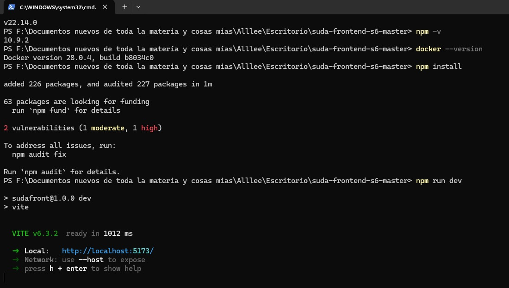
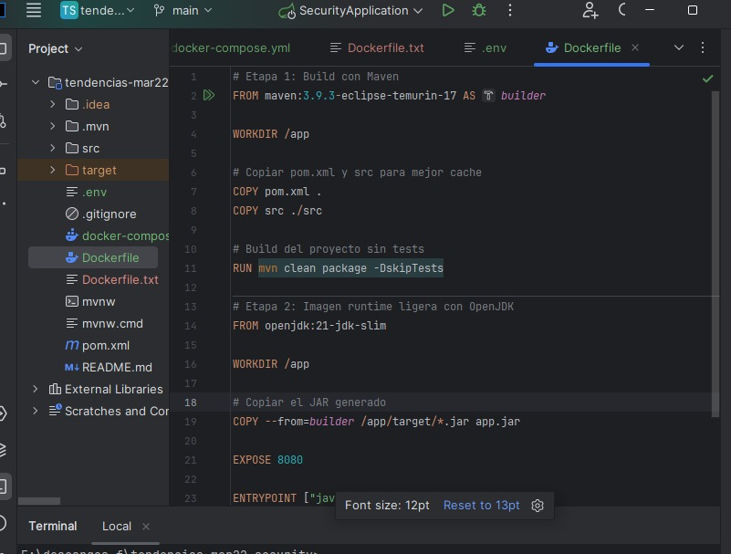

# TENDENCIAS TECNOLOGICAS

## 1. Titulo
Contenerización de una Aplicación React con NGINX usando Docker
## 2. Tiempo de duración
El tiempo de duración fue de 5 horas aproximadamente para el desarrollo de la práctica.

## 3. Fundamentos:
Hoy en día, una de las prácticas más utilizadas en el desarrollo de software es la contenerización. Esta técnica permite agrupar una aplicación junto con todas sus dependencias en un entorno aislado llamado contenedor. De esta manera, la aplicación puede funcionar de forma estable y coherente sin importar si se ejecuta en un entorno de desarrollo, pruebas o producción.

En esta práctica se utiliza Docker Compose, una herramienta fundamental para la gestión y orquestación de aplicaciones que constan de múltiples contenedores Docker. Docker Compose permite definir y ejecutar aplicaciones que requieren varios servicios interconectados, usando un solo archivo de configuración en formato YAML. Este archivo describe cómo se deben construir y conectar los contenedores, así como los volúmenes y redes que utilizan.

React es una biblioteca de JavaScript desarrollada por Facebook que se utiliza para construir interfaces de usuario dinámicas y reutilizables. Permite crear aplicaciones web de una sola página (Single Page Applications, SPA) mediante un modelo basado en componentes. Se basa en el uso de un DOM virtual, lo que mejora el rendimiento y la experiencia del usuario al actualizar solo las partes necesarias del sitio web.
En el contexto de contenerización, React necesita ser compilado con npm run build para generar archivos estáticos que puedan ser servidos por un servidor web como NGINX.

Pasos clave para contenerizar una aplicación React:

* Compilar el código fuente usando npm run build.

* Copiar los archivos generados a una imagen base de NGINX.

* Configurar NGINX para servir correctamente los archivos estáticos.

* Crear y ejecutar contenedores con Docker.

* Orquestar servicios con Docker Compose.

La práctica se enfoca en tres aspectos fundamentales:

- Uso de Docker Compose para gestionar múltiples servicios.

- Creación de imágenes Docker personalizadas desde una aplicación React.

- Configuración de volúmenes y redes para persistencia de datos y comunicación entre servicios.

- Comprensión del ciclo de construcción y despliegue de aplicaciones contenerizadas

Esta práctica permite a los estudiantes comprender los conceptos fundamentales como imágenes, contenedores, construcción y despliegue de servicios. Además, fomenta la integración de tecnologías modernas en entornos controlados, mejorando la eficiencia del desarrollo y facilitando la colaboración entre desarrolladore

## 4. Conocimientos previos.
Para realizar esta practica se necesita tener claro los siguientes temas:
- Línea de comandos (CLI)
- Comandos básicos de Linux
- Navegadores web y uso de puertos locales
- Uso de Docker
- Uso de Git y GitHub
- Conceptos de Servicios, redes y volumenes

## 5. Objetivos a alcanzar
- Implementar contenedores Docker para desplegar una aplicación React.
- Manejar archivos Dockerfile y nginx.conf.
- Ejecutar múltiples servicios simultáneamente como frontend y backend de forma simulada. 
- Identificar las instrucciones básicas de un Dockerfile 
- Configurar un servidor web NGINX
- Comprender el flujo de construcción de una imagen desde el Dockerfile hasta el contenedor en ejecución.

## 6. Equipo necesario:

- Navegador web 
- Computadora con sistema operativo Windows/Linux/Mac
- Acceso a - Docker versión 24.0 o superior
- Visual Studio Code (editor de código).
- Acceso a internet para clonar los repositorios de GitHub.

## 7. Material de apoyo.

- Dockerfile y ejemplos de configuración NGINX

- Documentación de React

- Guía proporcionada en la asignatura

- Repositorio del frontend: https://github.com/Daviddotcoms/suda-frontend-s6

- Repositorio del backend simulado: https://github.com/Daviddotcoms/mockAPI

- Linux Cheat Sheet: https://linuxcommand.org/lc3_learning_the_shell.php

## 8. Procedimiento

## Parte 1: Generar una imagen Docker a partir de una aplicación React

### Paso 1:Clona el repositorio del proyecto frontend.
git clone https://github.com/Daviddotcoms/suda-frontend-s6.git
cd suda-frontend-s6
npm install

### Paso 2:Ejecuta el proyecto localmente para verificar su correcto funcionamiento.
Ejecutar el proyecto localmente:
npm run dev
El proyecto se ejecuta localmente en http://localhost:5173.

### Paso 3: Crea un archivo Dockerfile adecuado para contenerizar la aplicación.

Se usa serve o NGINX para servir la aplicación React compilada.

### Paso 4: Genera la imagen Docker a partir del Dockerfile creado.

Construir la imagen Docker apartir de:  docker build -t suda-frontend-img .

### Paso 5: Crear el contenedor con la aplicación y ejecutar el backent simulado

Clonar y levantar el backend simulado: 
git clone https://github.com/Daviddotcoms/mockAPI.git
cd mockAPI
npm install
npm start

## 9. Resultados esperados:
- La aplicación React debe estar disponible en el navegador a través de http://localhost:8080, servida desde un contenedor NGINX.

- Las peticiones a la API deben ser correctamente respondidas por el backend simulado ejecutado en otro contenedor o de forma local.

- Al ejecutar docker ps, se deben visualizar los contenedores corriendo correctamente.

- Se verifica que la comunicación entre el frontend y el backend simulado es funcional, mostrando la interfaz operativa con datos reales desde la API.

- Este ejercicio demuestra que React puede ser desplegado eficientemente en producción usando NGINX y Docker, aplicando buenas prácticas de arquitectura de software moderna.

## 10. Bibliografía

* David DotComs (2025). Repositorio de práctica frontend. https://github.com/Daviddotcoms/suda-frontend-s6

* David DotComs (2025). Repositorio de mockAPI. https://github.com/Daviddotcoms/mockAPI

* Docker Inc. (2024). Docker documentation. https://docs.docker.com

* Miell, I., & Sayers, A. (2019). Docker in practice (2nd ed.). Manning Publications.

* Matthias & Kane (2015) sobre Dockerfile y build.

* NGINX. (2024). NGINX Documentation. https://nginx.org/en/docs

* ReactJS. (2024). Documentación oficial de React

