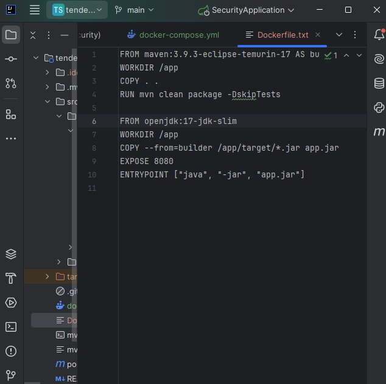

# TENDENCIAS TECNOLOGICAS

## 1. Titulo
 Despliegue backend con base de datos local.
## 2. Tiempo de duración
El tiempo de duración fue de 1 semana aproximadamente para el desarrollo de la práctica.

## 3. Fundamentos:
El despliegue de aplicaciones backend mediante contenedores Docker permite emular entornos de producción de forma segura, aislada y eficiente. Esta práctica se enfoca en contenerizar una base de datos PostgreSQL, junto con una herramienta gráfica de administración como pgAdmin, utilizando Docker y Docker Compose para gestionar la infraestructura.

En esta práctica se aprende a usar Docker para montar una base de datos PostgreSQL y administrarla con pgAdmin. Usar contenedores permite trabajar en entornos aislados, portables y fáciles de replicar.

Una imagen es como una plantilla y un contenedor es esa plantilla en acción. Los volúmenes permiten guardar datos aunque el contenedor se borre. El Dockerfile define los pasos para crear una imagen y el docker-compose.yml nos ayuda a levantar varios servicios a la vez, como la base de datos y la interfaz gráfica.

La instrucción build sirve para construir imágenes, y una build multietapa nos permite hacer imágenes más ligeras. Las redes en Docker permiten que los contenedores se comuniquen, y el archivo .env guarda configuraciones como puertos o contraseñas sin tener que escribirlas directamente en el código.

Todo esto hace que el desarrollo sea más organizado, profesional y cercano a lo que se usa en la industria real.

## 4. Conocimientos previos.

Para realizar esta practica se necesita tener claro los siguientes temas:
- Línea de comandos (CLI)
- Uso de Git y GitHub
- Navegadores web y uso de puertos locales
- Uso de Docker
- Conceptos de Servicios, redes y volumenes
- Introducción al Despliegue con Contenedores
- Contenedores para Servicios de Base de Datos
- Construcción de Artefactos (lenguajes compilados)
- Creación de Imágenes Docker 
- Orquestación con Docker Compose
- Manejo de variables ambiente y credenciales

## 5. Objetivos a alcanzar
- Configurar contenedores Docker para servicios de base de datos,
- Diseñar un contenedor de construcción que compile la aplicación y genere  el artefacto ejecutable
- Crear y optimizar archivos Dockerfile para generar imágenes eficientes
- Definir y estructurar archivos docker-compose.yml para orquestar el despliegue de una aplicación backend

## 6. Equipo necesario:

- Navegador web 
- Computadora con sistema operativo Windows/Linux/Mac
- Acceso a Docker versión 24.0 o superior
- Visual Studio Code (editor de código).
- Acceso a internet para clonar los repositorios de GitHub.
## 7. Material de apoyo.
- Dockerfile y ejemplos de configuración NGINX
- Introducción al Despliegue con Contenedores
- Documentación de React
- Guía proporcionada en la asignatura
- Proyecto base: https://github.com/maguaman2/tendencias-mar22-security.git

## 8. Procedimiento

## Parte 1: Despliegue backend con base datos local.

### Paso 1:Automatizar el despliegue de una aplicación backend utilizando Docker y Docker Compose, incluyendo la base de datos PostgreSQL y su panel de administración (pgAdmin), todo dentro de un entorno local. Proyecto base: https://github.com/maguaman2/tendencias-mar22-security.git

1.-Crear la base de datos posrgres y pgadmin con los bolumnes y redes correspondientes

1.1.-Crear la imagen de la aplicacion backend.

1.2.-Costruir el contenedor de la aplicacion 

1.3-Investigar sobre condiguraciones multi stage para optimizar automatizacion

### Paso 2:Configurar la base de datos local:

2.-Crear servicios para PostgreSQL y pgAdmin utilizando docker-compose.yml.

2.1.-Asegurar la correcta creación de volúmenes y redes para garantizar la persistencia y conectividad entre servicios.

2.2.-Verificar que pgAdmin pueda conectarse a PostgreSQL correctamente.

### Paso 3: Construir la imagen de la aplicación backend:

3.-Crear un Dockerfile que empaquete la aplicación.

3.1.-Utilizar una imagen base adecuada según el entorno de desarrollo (por ejemplo, Java 17 o 21).

Se esta usando openjdk:17-jdk-slim, para producción de Java 17.

### Paso 4: Levantar el contenedor de la aplicación:

4.-Configurar un servicio adicional en docker-compose.yml para la aplicación backend.

4.1.-Asegurar que la aplicación se conecte correctamente a la base de datos PostgreSQL.

4.2.-Definir las variables de entorno necesarias en un archivo .env.

### Paso 5: Investigar y aplicar configuraciones multi-stage:

5.-Investigar sobre la técnica de multi-stage builds en Docker para optimizar la construcción de imágenes.

Implementar una versión del Dockerfile que use esta técnica para reducir el tamaño de la imagen final y mejorar el proceso de automatización.

## 9. Resultados esperados:
- Desplegar exitosamente una aplicación backend con su base de datos PostgreSQL utilizando Docker y Docker Compose en un entorno local.

- Configurar de manera correcta las  redes, volúmenes y servicios, garantizando la persistencia y conectividad entre contenedores.

- Implementar un Dockerfile optimizado, aplicando la técnica de construcción multietapa (multi-stage builds).

- Verificar el funcionamiento integral del sistema, asegurando la conexión entre la aplicación, la base de datos y la interfaz de administración (pgAdmin).

- Automatizar el entorno de desarrollo simulando un escenario real de producción para mejorar la organización y escalabilidad.
 
## 10. Bibliografía

* Docker Inc. (2024). Docker Documentation. Recuperado de: https://docs.docker.com

* PostgreSQL Global Development Group. (2024). PostgreSQL Documentation. Recuperado de: https://www.postgresql.org/docs

* pgAdmin Team. (2024). pgAdmin Documentation. Recuperado de: https://www.pgadmin.org/docs

* Compose Specification. (2024). Docker Compose Specification. Recuperado de: https://compose-spec.io

* DigitalOcean. (2023). How To Use Docker Compose for Node.js and PostgreSQL. Recuperado de: https://www.digitalocean.com/community/tutorials

* https://github.com/maguaman2/tendencias-mar22-security.git

